# EZ-AFM
Quick and easy simulations of atomic force microscopy (AFM)-like pulling of macromolecules, using a simple Go-like model with Brownian dynamics.

## Potential of the system
The total configuration potential is the sum of the following energy terms:

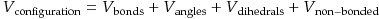

where:

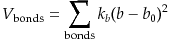

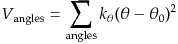

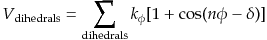

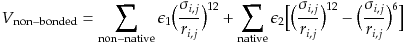

## Brownian Dynamics without hydrodynamics interaction
The displacement propagation of the system is obtained by solving the following equation numerically:

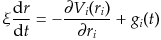

## Brownian Dynamics with hydrodynamics interaction 
#### (under testing and debugging)

When considering hydrodynamics interactions, the displacement propagation can be expressed as:

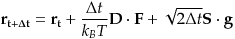

where **D** is the Ronte-Prager-Yamakawa diffusion tensor:

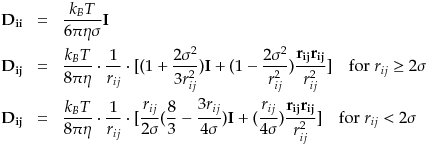

**g** is a Gaussian distributed array and **S** is obtained by Cholesky decomposition of **D** since:

## Notes
- Generate paramter files using gen-top, then run dynamics with main-prog.
- All the files (`crd`, `psf`, `dcd`, `prm` and `rtf`) generated will be compatible with CHARMM package for further analysis.
- Program currently under testing and debugging. 
- 3 short demos of ubiquitin are provided (Note the AFM-like simulations are pulling at high speed for quick demonstration):

1. Short equilibration

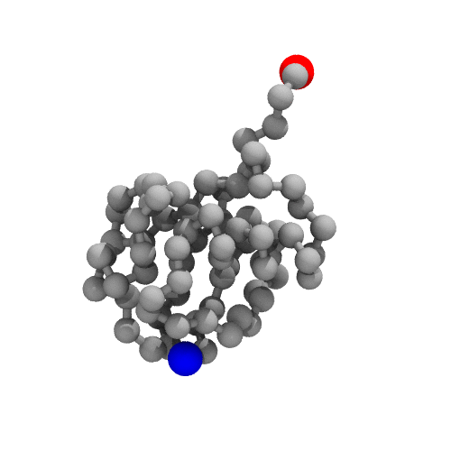

2. AFM-like pulling with N terminal fixed

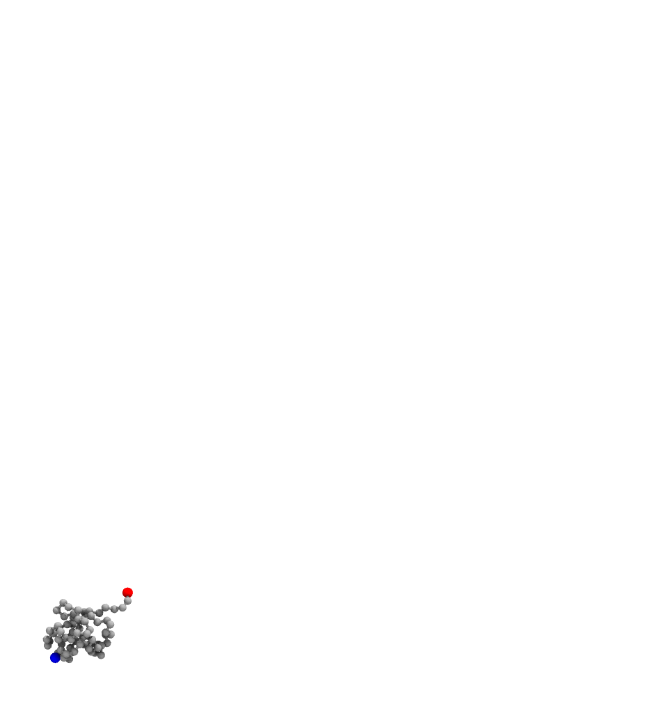

3. AFM-like pulling with out fixing any atom

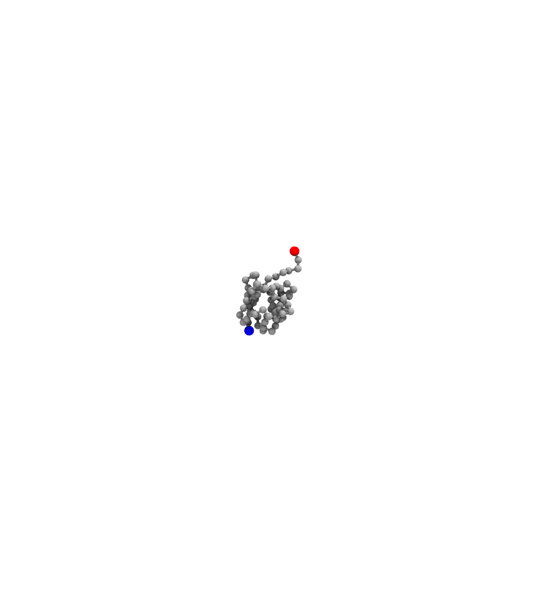
